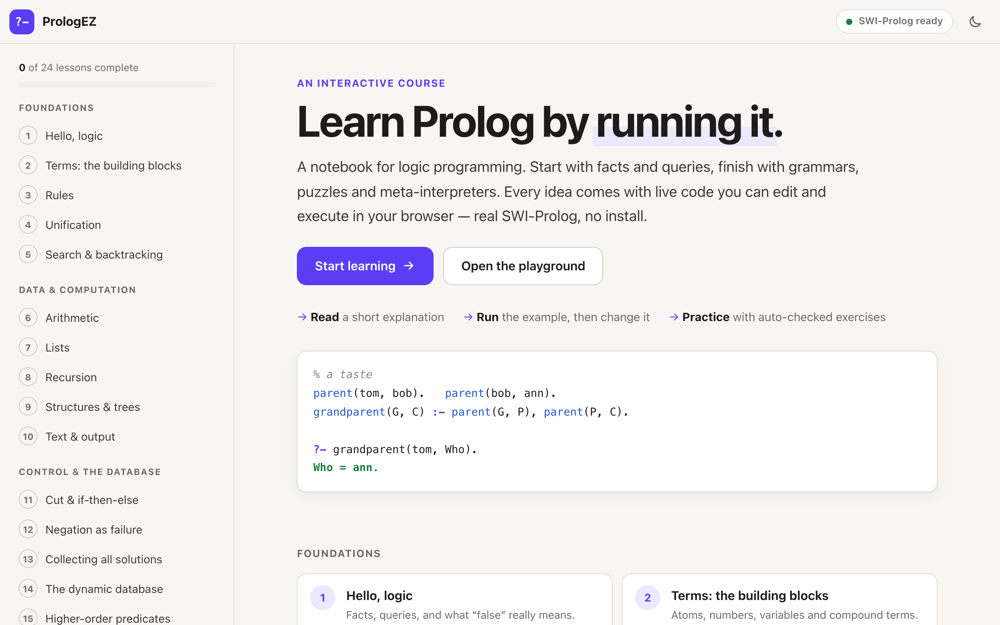
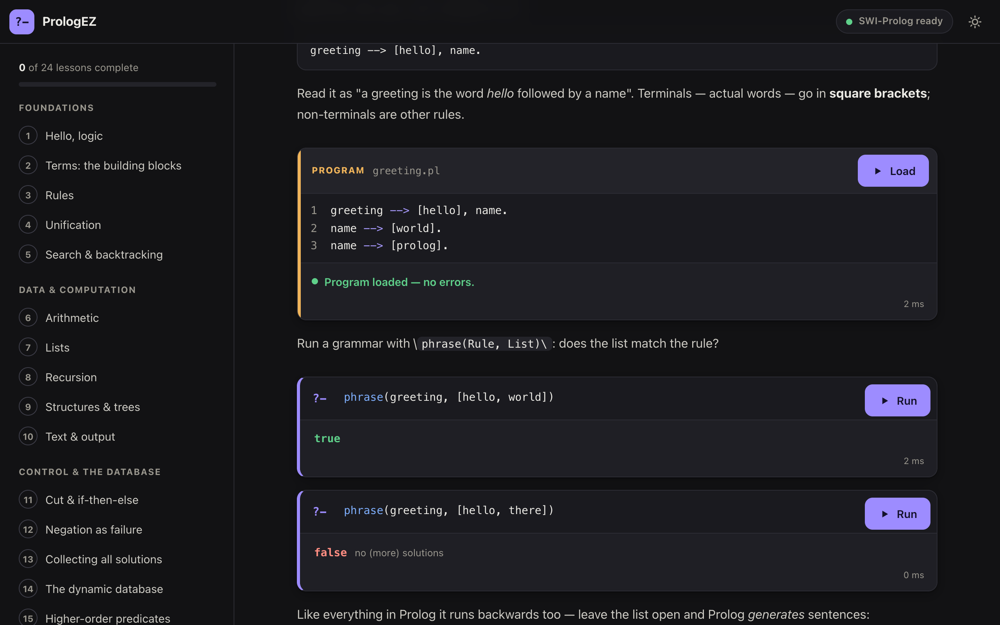
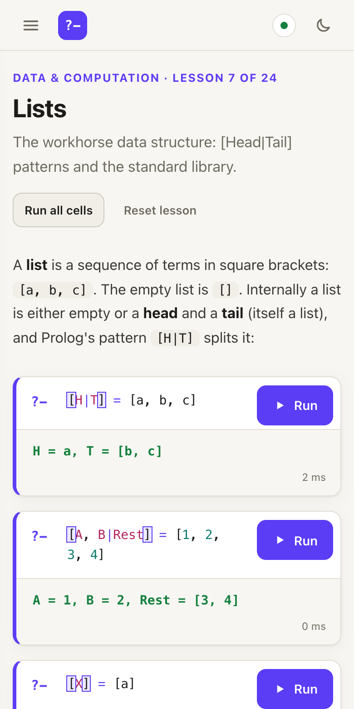

<h1 align="center">PrologEZ</h1>

<p align="center">
  <strong>Learn Prolog by running it.</strong><br/>
  An interactive, Jupyter-style course, real SWI-Prolog in your browser, no install.
</p>

<p align="center">
  
  
  
</p>

<p align="center">
  <a href="https://prologez.lucabonaldo.dev"><strong>Launch the app</strong></a> ·
  <a href="https://github.com/LucaBonaldoIT/prologez/issues">Report an issue</a> ·
  <a href="CONTRIBUTING.md">Contributing</a> ·
  <a href="SECURITY.md">Security</a>
</p>

<p align="center"></p>

## Features

- **43 lessons** from facts and queries to DCGs, constraint solving and meta-interpreters.
- **Notebook cells**: edit a program, load it, run queries against it: all in the page.
- **45 auto-checked exercises** with hints and solutions.
- **Real SWI-Prolog 9** (WebAssembly) in a Web Worker: CLP(FD), tabling, strings, DCGs, big integers.
  Nothing is sent to a server; runaway queries can't freeze the page and are stopped automatically.
- **Interpreter stepper**: the _Step_ button next to _Run_ walks through any query one resolution step at a time (selected goal, clause used, unifier, new resolvent, substitution, cuts and backtracking).
- **Search** across every lesson (press `/` or Ctrl/Cmd+K): titles, explanations, programs, queries and exercise prompts.
- **Playground** for free experimentation, with starter examples.
- **Responsive** (desktop and mobile), light/dark themes, progress saved in the browser.
- **Tested content**: `npm run verify` executes every lesson example and exercise against SWI-Prolog.

<p align="center">
  
  
</p>

## Curriculum

1. **Foundations**: hello logic · terms · syntax & execution model · logic vs. imperative programming · rules · the parent/child knowledge base · unification · terms, substitutions & the MGU · search & backtracking · resolution step by step
2. **Data & computation**: natural numbers & Peano · Peano arithmetic · booleans as a data type · a program as a database · arithmetic · built-in operators & math · lists · lists from scratch (cons/nil) · full relationality · recursion · performance, tail recursion & immutability · generating combinations & searching · structures & trees · algorithms on other data types · inspecting & managing terms · text & output
3. **Control & the database**: cut & if-then-else · negation · all-solutions · assert/retract/clause · higher-order · exceptions
4. **Advanced**: DCGs · difference lists · generate & test · CLP(FD) · constraints in practice (is vs #=, queens, sudoku, knapsack) · graph search · operators & DSLs · solving goals as terms · meta-interpreters · symbolic computation · Sudoku capstone

## SEO and deployment

The app uses real paths (`/`, `/lesson/<id>/`, `/playground/`, `/about/`). `npm run build` (or `./build.sh`)
runs `vite build` and then `scripts/prerender.mjs`, which writes a static, crawlable HTML page for every route
into `dist/`: unique `<title>` and meta description, canonical URL, Open Graph and Twitter tags, JSON-LD
(`Course`, `LearningResource`, `BreadcrumbList`, `Person`), the lesson text itself, plus `sitemap.xml`, `robots.txt`
and `404.html`. The app takes over as soon as the JavaScript runs. Old `#/lesson/...` links are upgraded.

The production URL lives in `src/seo.js` (`SITE.url`, default `https://prologez.lucabonaldo.dev`); override it
at build time with `SITE_URL=https://example.com npm run build`. Any static host works, since every route is a real
file; point 404s at `404.html`.

## Run it

```sh
npm install
npm run dev        # http://localhost:5173
npm run build      # static site in dist/
npm run preview
npm run verify     # runs every query and exercise in every lesson against SWI-Prolog
```

The build is a fully static site (`base: './'`), so it can be hosted anywhere, including a sub-path.
Serve `.js` files with `charset=utf-8`.

## How it works

| piece                                                                 | file                                          |
| --------------------------------------------------------------------- | --------------------------------------------- |
| Lessons (plain data: markdown, program cells, query cells, exercises) | `src/lessons/*.js`                            |
| Notebook UI: cells, editors, outputs, exercises                       | `src/notebook.js`, `src/editor.js`            |
| App shell, router, sidebar, progress, playground                      | `src/main.js`, `src/playground.js`            |
| Worker client (run, stop, restart on hang)                            | `src/engine.js`, `src/engine.worker.js`       |
| SWI-Prolog wrapper + toplevel-style harness                           | `src/prolog/core.js`, `src/prolog/harness.js` |

- A **program cell** adds clauses; a **query cell** runs against every program cell above it.
  Each run starts from a clean module, so assertions never leak between runs.
- The harness (`harness.js`) is a few dozen lines of Prolog that loads the program, runs one query,
  collects up to _N_ solutions as they are found, formats answers like the SWI toplevel
  (`X = [1, 2]`, `X = Y`, CLP(FD) residual goals), and captures output, warnings and errors.
- Runaway queries are stopped by an inference limit, a stack limit, and finally a worker watchdog.
- Progress and edits live in `localStorage`.

## Documentation

- [Writing lessons](docs/writing-lessons.md)
- [Architecture](docs/architecture.md)
- [Contributing](CONTRIBUTING.md) · [Code of conduct](CODE_OF_CONDUCT.md) · [Security](SECURITY.md)

## Writing a lesson

Lessons are modules built from four helpers (see `src/lessons/dsl.js`):

```js
import { md, program, query, exercise, lesson } from './dsl.js';

export const demo = lesson({
  id: 'demo',
  part: 'Foundations',
  title: 'Demo',
  summary: 'One line.',
  blocks: [
    md('Some **markdown**, with `code`, lists, tables and `> [!tip]` callouts.'),
    program('likes(alice, tea).', { title: 'likes.pl' }),
    query('likes(alice, X)', { expect: ['X = tea'] }),
    exercise({
      title: 'Add a fact',
      prompt: 'Make bob like tea.',
      starter: '% ...',
      solution: 'likes(bob, tea).',
      tests: [{ q: 'likes(bob, tea)', expect: ['true'] }],
    }),
  ],
});
```

Add it to `src/lessons/index.js`, then run `npm run verify`: every query must run without
error (unless marked `error: true`), every `expect` must match, every exercise's `solution` must
pass its tests, and its `starter` must not.

## License

[MIT](LICENSE). SWI-Prolog (BSD-2-Clause) and other dependencies are listed in
[THIRD_PARTY_NOTICES.md](THIRD_PARTY_NOTICES.md).
